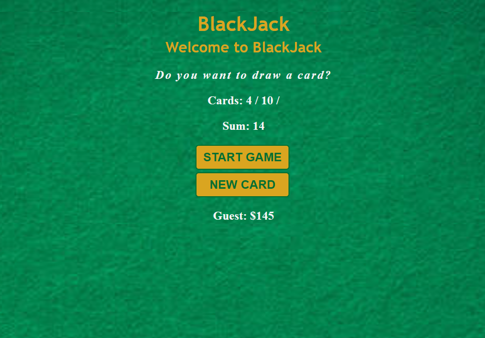

# Blackjack Game

This is a simple implementation of the Blackjack game in HTML, CSS, and JavaScript.



## Table of Contents

- [Description](#description)
- [Demo](#demo)
- [Installation](#installation)
- [Usage](#usage)
- [Contributing](#contributing)
- [License](#license)

## Description

The Blackjack Game project is a web-based application that allows players to play the popular card game Blackjack. The game is built using HTML, CSS, and JavaScript, and it provides a simple interface for players to interact with the game.

## Demo

You can see a live demo of the Blackjack Game [here](https://saqlain-qark.github.io/BlackJack-Game/).

## Installation

To run the Blackjack Game locally, follow these steps:

1. Clone the repository:

```bash
git clone https://github.com/Saqlain-qark/BlackJack-Game.git
```

2. Navigate to the project directory:

```bash
cd BlackJack-Game
```

3. Open the `BlackJack_Game.html` file in your preferred web browser.

## Usage

Once you have the game running, follow these steps to play Blackjack:

1. Click on the "START GAME" button to start a new game.
2. Two cards will be dealt, and their values will be displayed in the "Cards" section.
3. The sum of the cards will be displayed in the "Sum" section.
4. If the sum is less than or equal to 20, you will be prompted to choose whether to draw a new card.
5. Click on the "NEW CARD" button to draw a new card and add its value to the sum.
6. The game will check if you have reached 21 (a Blackjack) or have gone over 21 (bust).
7. The game will display a message indicating whether you win, lose, or can continue drawing cards.
8. Continue playing by choosing to draw a new card or stopping the game.

## Contributing

Contributions to the Blackjack Game project are welcome! If you have any suggestions, bug reports, or feature requests, please open an issue on the [GitHub repository](https://github.com/Saqlain-qark/BlackJack-Game/issues).

## License

This project is licensed under the [MIT License](LICENSE).
